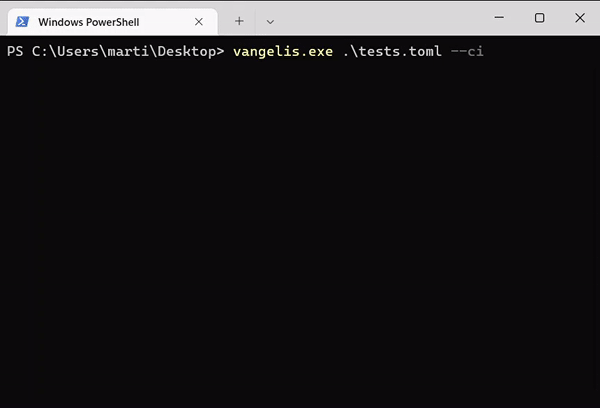

<h1 align="center">
  Vangelis
</h1>
<p align="center">
  <a href="https://github.com/martin-olivier/Vangelis/releases/tag/v2.0.0">
    
  </a>
  <a href="https://github.com/martin-olivier/Vangelis/blob/main/LICENSE">
    
  </a>
  <a href="https://www.rust-lang.org/">
    
  </a>
  <a href="https://github.com/martin-olivier/Vangelis/actions/workflows/CI.yml">
    
  </a>
</p>

  

This software takes test files as parameter that contains lists of commands to be run and expected stdout, stderr, exit status, and tell the user if the tests succeed, failed or crashed.

`⭐ Don't forget to put a star if you like the project!`

## ⚠️ Requirements
This software works on `Linux`, `MacOS`, and `Windows` 

To build and install the project, you will need [cargo](https://www.rust-lang.org/tools/install)

## 💻 Installation

```
git clone https://github.com/martin-olivier/vangelis
cargo install --path vangelis
```

## 📒 Manual

```
USAGE:
        vangelis [TESTFILES] [OPTIONS]

TESTFILES:
        path to one or multiple test files

OPTIONS:
        --help          Display this help menu
        --version       Display the current version
        --changelog     Display the changelog
        --verbose       Display the output difference in the shell
        --diff          Display the output difference in Visual Studio Code
        --ci            Stop the execution if a test didn't succeed

RETURN VALUE:
        0               if all tests succeed
        1               if one or more tests failed
        84              if a critical error occured
```

## 🗂 Test File

Test files must have the following pattern in [toml](https://toml.io/en/)
```
# Definitions

Default {
    exit_status: Option<Integer>,
    timeout: Option<Float>,
    working_dir: Option<String>,
    runs_on: Option<Array<String>>,
    unix_shell: Option<String>,
    windows_shell: Option<String>,
}

Test {
    cmd: String,
    stdin: Option<String>,
    stdout: Option<String>,
    stderr: Option<String>,
    exit_status: Option<Integer>,
    timeout: Option<Float>,
    working_dir: Option<String>,
    runs_on: Option<Array<String>>,
    unix_shell: Option<String>,
    windows_shell: Option<String>,
}

# Test file content

TestFile {
    default: Option<Default>,
    test: Map<String, Test>,
}
```

## 📝 Example

```toml
# testfile.toml

[default]
# use powershell as default shell on windows
windows_shell = "powershell"

[test.echo]
cmd = "echo hello"
stdout = "hello\n"

[test.power]
# this test can only run under unix systems
runs_on = ["linux", "macos"]
cmd = "whoami"
stdout = "root\n"

[test.sleep]
# this test will timeout
timeout = 5
cmd = "sleep 10"
stdout = ""
stderr = ""

[test."print args"]
cmd = "python3 print_args.py hey brother"
stdout = """
hey
brother
"""
stderr = ""

[test."print stdin"]
cmd = "python3 print_stdin.py"
stdin = """
hey
brother
"""
stdout = """
hey

brother

"""
stderr = ""
```

To run this example, enter the following command:
```sh
vangelis examples/testfile.toml
```

## ⚙️ Parameters

```toml
[cmd]

# Command to run (mandatory value)

# Example:
# Build a software and ensure the build takes less that 300 seconds:
cmd = "make"
timeout = 300
```

```toml
[stdout]

# Expected stdout of the command

# Example:
# I want to check if I have root privileges:
cmd = "whoami"
stdout = "root\n"
```

```toml
[stderr]

# Expected stderr of the command

# Example:
# I Expect this error message for the following command:
cmd = "ls /root"
# expected stderr
stderr = "ls: cannot open directory '/root': Permission denied\n"
```

```toml
[stdin]

# stdin content to be forwarded to the command

# Example:
cmd = "cat"
# stdin content
stdin = "hello"
# expected stdout
stdout = "hello"
```

```toml
[exit_status]

# Set the expected exit status of a command

# Default value:
exit_status = 0

# Example:
# The test will expect a return value of 1
exit_status = 1
cmd = "git"
```

```toml
[timeout]

# Set the timeout of a command (in seconds)

# Default value:
timeout = 60

# Example:
# The command must not exceed 5 seconds
timeout = 5
cmd = "sleep 10"
```

```toml
[runs_on]

# An array of strings that defines on witch os the test is allowed to run

# Default value:
runs_on = ["linux", "windows", "macos"]

# Example:
# The test will only run under linux
runs_on = ["linux"]
```

```toml
[unix_shell]

# Set the shell to use to run commands under unix systems

# Default value:
unix_shell = "sh"

# Example:
# The command will run under "zsh" instead of "sh" under linux
unix_shell = "zsh"
```

```toml
[windows_shell]

# Set the shell to use to run commands under windows

# Default value:
windows_shell = "cmd"

# Example:
# The command will run under "powershell" instead of "cmd" under windows
windows_shell = "powershell"
```

```toml
[working_dir]

# Set the working directory of a test
# by default, the path is set where the testfile is located
# working_dir value can be a relative or a full path

# Default value
working_dir = "."

# Examples:
# Set the working directory of the command to "/tmp"
working_dir = "/tmp"
cmd = "ls"
# Set the working directory of the command to the parent folder of the testfile
working_dir = ".."
cmd = "ls"
```

## 💡 Build Tips
If you want to uninstall Vangelis:  
`cargo uninstall`  

If you just want to get the binary without installing:  
`cargo build`  
